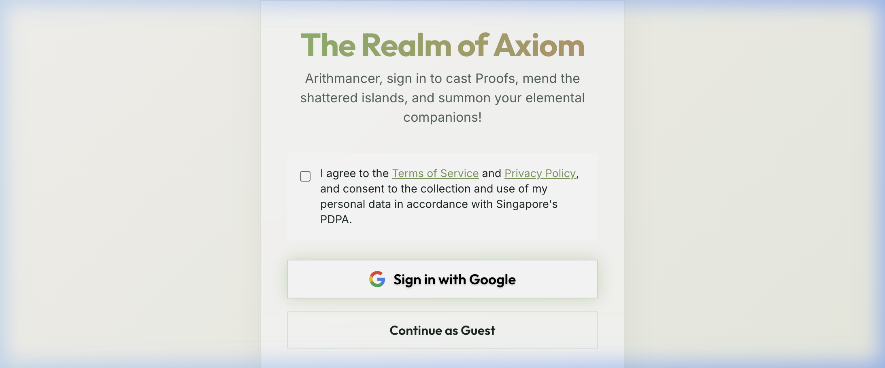
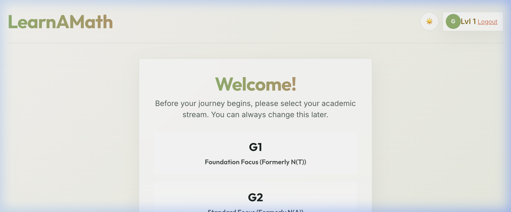
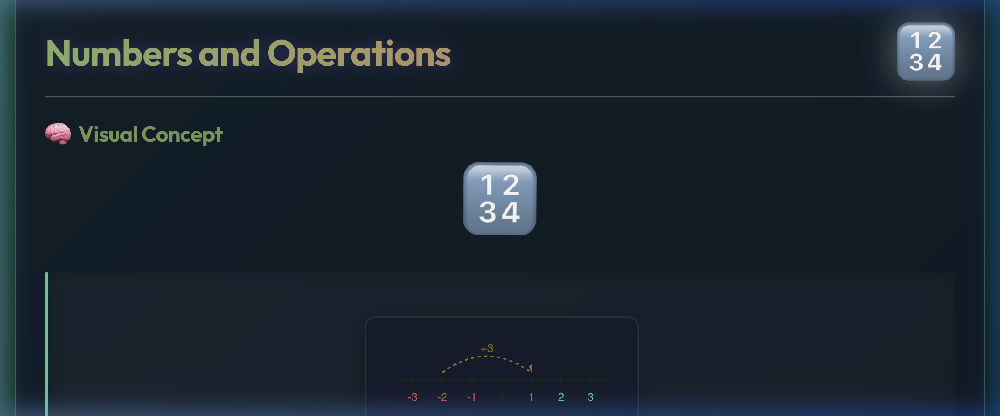

# Realm of Axiom: LearnAMaths 🏔️🍵

[](https://learn-a-math.vercel.app)
[](https://opensource.org/licenses/MIT)
[](https://vitejs.dev/)

**Realm of Axiom** (LearnAMaths) is a premium, gamified learning platform designed to help students master the MOE Additional Mathematics syllabus through a serene, interactive, and high-quality "Mountain Tea" aesthetic. It transforms the rigor of secondary mathematics into an immersive journey of discovery and resonance.

🌐 **Live Website**: [https://learn-a-math.vercel.app](https://learn-a-math.vercel.app)

---

## ✨ Core Pillars

### 📘 Infinite Resonance (Learning)

High-density, interactive study guides ("Crash Courses") featuring precision LaTeX rendering for flawless mathematical notation.

### ⚡ Sigil Cleansing (Testing)

A vast domain of hundreds of questions across G1, G2, G3, and Additional Mathematics syllabuses, designed to test and reinforce conceptual mastery.

### 🦊 Elemental Companions

Collect and evolve unique spirits (Terra, Aqua, Aero, Ignis, Void, Luminous) as you gain XP and ascend through the mathematical ranks.

### 📱 Perfect Portability

A full Progressive Web App (PWA) experience, installable on iOS, Android, and Desktop for seamless learning anywhere, even offline.

---

## 🖼️ Visual Experience

<p align="center">
  
</p>

<p align="center">
  
  
</p>

---

## 🛠️ The Forge (Technology Stack)

- **Frontend**: [React](https://reactjs.org/) + [Vite](https://vitejs.dev/)
- **Visuals**: Vanilla CSS (Custom Glassmorphism 2.0 & Fluid Typography)
- **Math Engine**: [KaTeX](https://katex.org/) for high-fidelity rendering
- **Motion**: [Framer Motion](https://www.framer.com/motion/) for fluid animations
- **State**: Precise Context API architecture with persistent LocalStorage

---

## 🚀 Getting Started

### Development

1. **Clone & Install**:

   ```bash
   git clone https://github.com/Jick456/LearnAMath.git
   cd LearnAMath
   npm install
   ```

2. **Launch Domain**:

   ```bash
   npm run dev
   ```

### Deployment

To generate a production-ready distribution:

```bash
npm run build
```
The output in `dist/` is optimized for zero-config hosting on [Vercel](https://vercel.com).

---

## 🤝 Contributing

We welcome scholars and architects! Please see [CONTRIBUTING.md](CONTRIBUTING.md) for guidelines on how to improve the realm.

## 📜 License

This project is licensed under the MIT License - see the [LICENSE](LICENSE) file for details.

---

*Brewed with logic and matcha by the Masters of Mathematics.*
